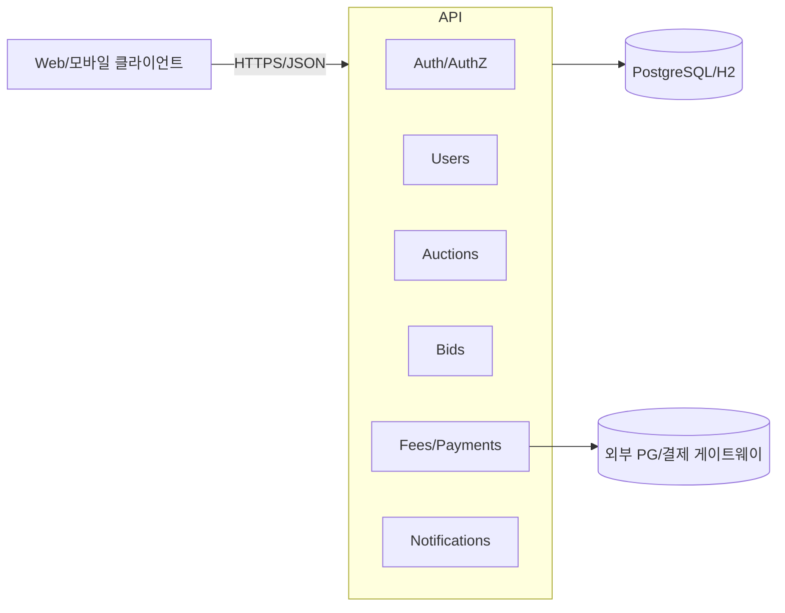
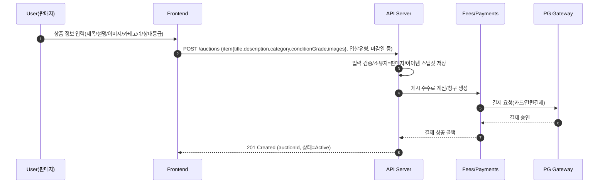
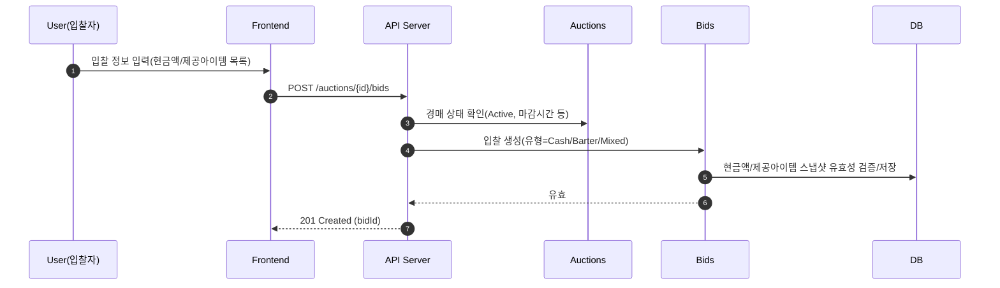
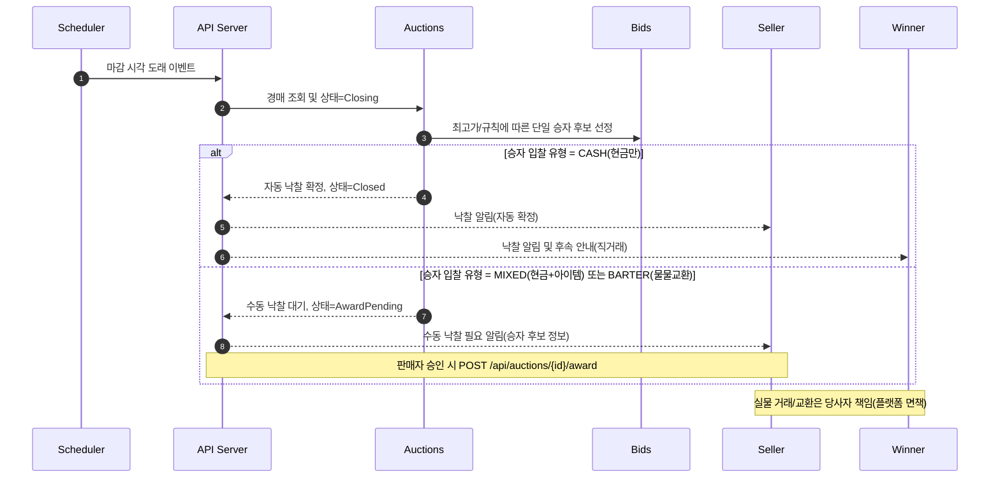
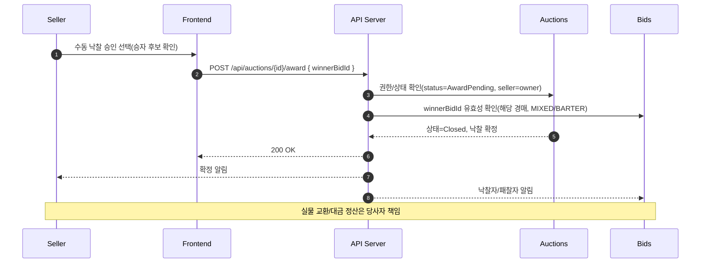
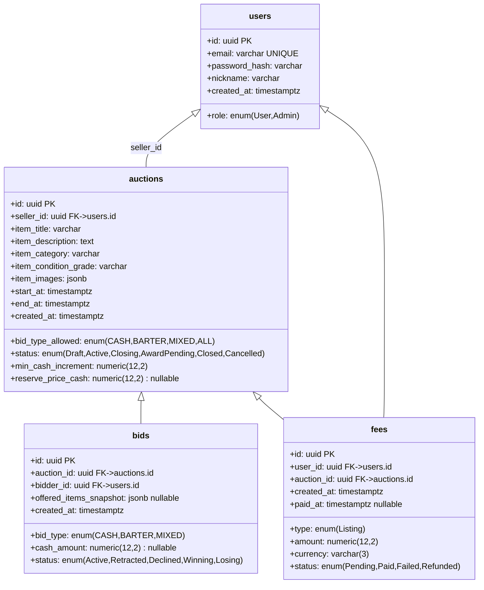
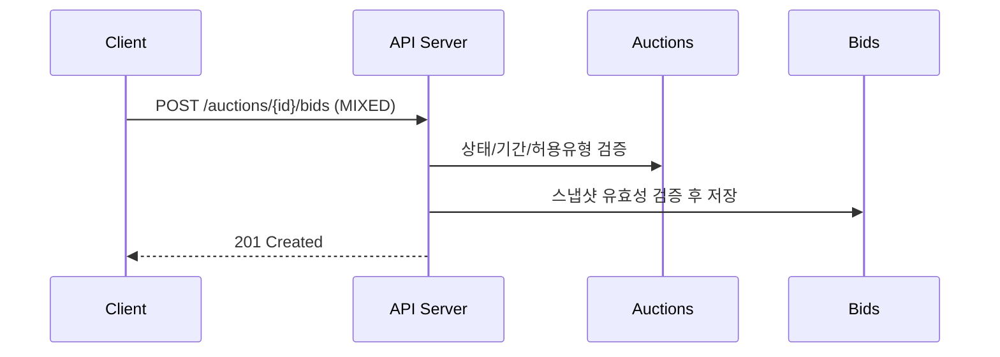

# 프로젝트 제로 경매 플랫폼 – 아키텍처/흐름/스키마/API/화면 기획서

문서버전: v1.2
작성일: 2025-08-20

## 1. 개요(Requirement Summary)
- 입찰 유형: 물물교환(아이템 교환), 현금, 혼합(아이템+현금)
- 낙찰 규칙: 단일 승자 경매(Single-Winner)
- 실제 물품의 교환/거래는 사용자(소비자) 간 직접 수행, 플랫폼은 책임지지 않음(면책 고지)
- 플랫폼은 게시(등록) 수수료를 수취하는 구조(정액/정률 중 정책 선택)
- 구성: 단일 API 서버(모놀리식; 인증/인가, 회원/리소스 관리, 경매 로직 포함)
- 산출: 전체 흐름도, 스키마 정의, API 정의(mermaid), 프론트엔드 화면 기획(문서)

## 2. 면책 고지(Disclaimers)
- 본 플랫폼은 거래 중개를 위한 게시 및 입찰 기능만 제공하며, 실물의 배송/대금 결제/검수/환불 등 실제 거래 행위에 개입하지 않습니다.
- 물품 인도, 대금(현금 성분) 수수 및 교환 조건 충족 여부는 전적으로 당사자(판매자/구매자) 책임입니다.
- 분쟁 발생 시 플랫폼은 법적 책임을 지지 않으며, 필요한 경우 증빙(게시/입찰 로그 등)만 제공할 수 있습니다.

## 3. 수수료 및 과금 정책(Fee Model)
- 기본: 게시(등록) 시 수수료 과금
  - 예: 고정 1,000원 또는 카테고리별 정책(향후 확장)
- 수수료 결제 실패 시 게시 실패 처리
- 낙찰/거래 성사 여부와 무관하게 게시 수수료는 환불 불가(정책 예시)

## 4. 시스템 아키텍처 개요
- 단일 모놀리식 API 서버
  - 모듈(패키지) 구성 제안: auth, users, auctions, bids, fees, notifications, commons
  - 데이터 저장소: PostgreSQL(운영), H2(개발)
  - 인증/인가: JWT(Bearer)



## 5. 주요 비즈니스 플로우(Flow Diagrams)

### 5.1 게시(등록) + 수수료 과금


### 5.2 입찰(현금/물물/혼합)


### 5.3 마감/낙찰 및 후속 처리(자동/수동 분기)


### 5.4 수동 낙찰 흐름(물물교환/혼합 입찰)


## 6. 데이터 스키마 정의(Data Schema)

### 6.1 ER 개요


### 6.2 제약 및 비즈니스 규칙
- auctions는 경매 개설 시점의 아이템 스냅샷을 보관(제목/설명/카테고리/상태등급/이미지), 외래키 없음
- 스냅샷은 경매 수명주기 동안 변경 불가(불변); 원본 Items 변경과 무관
- bids.cash_amount는 bid_type이 CASH 또는 MIXED일 때만 필수
- bids.offered_items_snapshot는 bid_type이 BARTER 또는 MIXED일 때 1개 이상 필요(JSON 배열)
- offered_items_snapshot는 사용자가 입찰 시 직접 입력한 제공 아이템 스냅샷 목록으로만 관리되며, 별도 재고/소유권 검증이나 외래키를 두지 않음
- 낙찰 선정 규칙(단일 승자):
  1) 비교 우선순위: 현금가 우선 > 제공아이템 가치 평가(내부 스코어, 초기에는 정책상 미사용 가능) > 시간 선착
  2) 혼합의 경우 현금액 비교를 1차 기준으로 적용
- 낙찰 확정 정책:
  - 승자 입찰이 CASH(현금만)인 경우: 시스템이 자동으로 낙찰 확정하고 auctions.status=Closed로 전이
  - 승자 입찰이 MIXED(현금+아이템) 또는 BARTER(물물교환)인 경우: auctions.status=AwardPending으로 전이하여 판매자 수동 확정 필요(POST /api/auctions/{id}/award)
  - AwardPending 상태에서는 판매자만 확정 가능하며, 확정 후 auctions.status=Closed

## 7. API 정의

### 7.1 공통
- Base URL: /api
- 인증: Authorization: Bearer <JWT>
- 오류 포맷
```json
{
  "timestamp": "2025-08-20T07:00:00Z",
  "status": 400,
  "error": "Bad Request",
  "code": "VALIDATION_ERROR",
  "message": "cashAmount is required for CASH bid",
  "path": "/api/auctions/123/bids"
}
```

### 7.2 엔드포인트 목록(상세)
- Auth
  - POST /api/auth/register — 회원 가입 (공개). Body: email, password, nickname. 201 Created 또는 400.
  - POST /api/auth/login — 로그인/JWT 발급 (공개). Body: email, password. 200 OK {accessToken} 또는 401.
- Users
  - GET /api/users/me — 내 프로필 조회 (JWT). 200 OK.
- Me
  - GET /api/me/bids — 내가 입찰 넣은 목록 조회 (JWT). Query: status?, page, size. 200 OK(Pagination). 현금 입찰 허용 경매의 경우 현재 최고 입찰가와 다음 입찰가를 함께 제공.
  - GET /api/me/auctions — 내 경매 목록(내가 판매자인 게시들) (JWT). Query: status?, page, size. 200 OK(Pagination).
- Auctions
  - POST /api/auctions — 경매 개설 (JWT). Body: item{title,description,category,conditionGrade,images}, bidTypeAllowed, endAt, minCashIncrement, reservePriceCash. 201 Created {id,status=Active}.
  - GET /api/auctions/{id} — 경매 상세 조회 (공개). 200 OK 또는 404.
  - GET /api/auctions?status=Active&page=1&size=20 — 경매 목록 조회/검색 (공개). Query: status, page, size. 200 OK(Pagination).
  - POST /api/auctions/{id}/award — 물물교환/혼합 입찰 승자 수동 확정 (JWT, 판매자 전용, 상태=AwardPending). Body: winnerBidId. 200 OK 또는 400/403/409.
- Bids
  - POST /api/auctions/{auctionId}/bids — 입찰 생성 (JWT). Body: bidType, cashAmount?, offeredItemsSnapshot[]. 201 Created.
  - GET /api/auctions/{auctionId}/bids — 경매의 입찰 목록 조회 (공개). Path: auctionId. 200 OK.
- Fees/Payments
  - POST /api/fees/checkout — 게시 수수료 결제 세션 생성 (JWT, 경매 소유자). Body: auctionId. 200 OK(결제세션/리다이렉트).
  - POST /api/fees/webhook — PG 결제 웹훅 수신 (공개, 서명 검증). Body: event, feeId, pgPayload. 200 OK.

### 7.3 주요 API 스펙

#### 7.3.2 POST /api/auctions
Request
```json
{
  "item": {
    "title": "중고 기타",
    "description": "상태 양호",
    "category": "music",
    "conditionGrade": "B",
    "images": ["https://.../1.jpg", "https://.../2.jpg"]
  },
  "bidTypeAllowed": "MIXED",
  "endAt": "2025-09-01T12:00:00Z",
  "minCashIncrement": 1000,
  "reservePriceCash": 50000
}
```
Response 201
```json
{ "id": "uuid", "status": "Active" }
```

Note: 경매 내 아이템 정보는 스냅샷으로 저장되며 경매 진행 중 변경되지 않습니다.

#### 7.3.3 POST /api/auctions/{auctionId}/bids
설명: 재고(Inventory) 없이, 입찰 시 제공 아이템 정보를 스냅샷으로 직접 전달합니다. 입찰 유형(BidType)에 따라 요청 필수값/제약이 다르므로 아래를 각각 따로 확인하세요.

공통 응답(성공)
```json
{ "id": "uuid", "status": "Active" }
```

##### 7.3.3.1 CASH(현금) 입찰
Request 예시
```json
{
  "bidType": "CASH",
  "cashAmount": 70000
}
```
Validation 규칙
- cashAmount 필수(> 0)
- offeredItemsSnapshot는 생략 또는 비워야 함(허용 안 함)
- 경매가 현금 입찰을 허용해야 함(auctions.bid_type_allowed ∈ {CASH, MIXED, ALL})
비고
- 동점 처리: 동일 cashAmount인 경우 created_at가 더 이른 입찰이 선행(leading)
- 승자 유형이 CASH인 경우 마감 시 자동 낙찰 확정(Closed로 전이)

##### 7.3.3.2 BARTER(물물교환) 입찰
Request 예시
```json
{
  "bidType": "BARTER",
  "offeredItemsSnapshot": [
    {
      "title": "교환 제안 아이템 1",
      "description": "양호",
      "category": "music",
      "conditionGrade": "B",
      "images": ["https://.../barter1.jpg"]
    }
  ]
}
```
Validation 규칙
- offeredItemsSnapshot 1개 이상 필수
- cashAmount 금지 또는 0(생략 권장)
- 경매가 물물교환 입찰을 허용해야 함(auctions.bid_type_allowed ∈ {BARTER, MIXED, ALL})
비고
- 초기 정책에서는 제공 아이템 가치를 자동 산정하지 않을 수 있음(판매자 검토 요소)
- 낙찰 확정은 규칙/정책에 따르며, 단일 승자 선정 시 CASH보다 후순위가 될 수 있음
- BARTER 입찰이 승자 후보인 경우 상태=AwardPending으로 전이하며 판매자 수동 확정 필요(POST /api/auctions/{id}/award)

##### 7.3.3.3 MIXED(현금+아이템) 입찰
Request 예시
```json
{
  "bidType": "MIXED",
  "cashAmount": 60000,
  "offeredItemsSnapshot": [
    {
      "title": "기타 페달 A",
      "description": "약간 사용감 있음",
      "category": "music",
      "conditionGrade": "B",
      "images": ["https://.../pedalA.jpg"]
    },
    {
      "title": "케이블 세트",
      "description": "거의 새 것",
      "category": "accessory",
      "conditionGrade": "A",
      "images": []
    }
  ]
}
```
Validation 규칙
- cashAmount > 0 필수
- offeredItemsSnapshot 1개 이상 필수
- 경매가 혼합 입찰을 허용해야 함(auctions.bid_type_allowed ∈ {MIXED, ALL})
비고
- 비교 1차 기준은 cashAmount이며, 동일 금액이면 선입찰 우선
- 혼합 입찰이 승자 후보인 경우 상태=AwardPending으로 전이하며 판매자 수동 확정 필요(POST /api/auctions/{id}/award)

공통 비고
- 제공 아이템 스냅샷은 사용자가 직접 입력하며 별도 재고/소유권 검증은 수행하지 않음(스냅샷 보관)
- seller 본인은 자신의 경매에 입찰할 수 없음(권한/검증 규칙)
- 마감/낙찰 및 동점 처리 등은 6.2 및 10장 정책을 따름

#### 7.3.4 Fees
- POST /api/fees/checkout
```json
{ "auctionId": "uuid" }
```
- POST /api/fees/webhook
```json
{ "event": "payment.succeeded", "feeId": "uuid", "pgPayload": {"...": "..."} }
```

#### 7.3.5 POST /api/auctions/{auctionId}/award
설명: 혼합(MIXED) 또는 물물교환(BARTER) 입찰이 승자 후보일 때, 판매자가 수동으로 낙찰을 확정.

요청(판매자 JWT 필요; 경매 소유자만 가능; 경매 상태=AwardPending)
```json
{ "winnerBidId": "uuid" }
```

응답 200
```json
{ "auctionId": "uuid", "status": "Closed", "winnerBidId": "uuid" }
```

에러
- 400 BAD_REQUEST: invalid winnerBidId, bid not MIXED/BARTER, or bid not for this auction
- 403 FORBIDDEN: not the seller/owner
- 409 CONFLICT: auction not in AwardPending or already closed

#### 7.3.6 GET /api/me/bids — 내가 입찰 넣은 목록
Query: status(optional: Active, Retracted, Declined, Winning, Losing), page, size

설명:
- 사용자가 참여한 입찰 목록을 페이징으로 반환합니다.
- 경매가 현금 입찰을 허용하는 경우(auctions.bid_type_allowed ∈ {CASH, MIXED, ALL}): 각 항목에 대해 다음 현금 요약을 포함합니다.
  - cashSummary.leadingCashAmount: 현재 최고 현금 입찰가(동점 시 선입찰 기준)
  - cashSummary.nextBidCashAmount: 다음 입찰 가능 최소 현금가 = leadingCashAmount + auctions.min_cash_increment

Response 200 (예시; MIXED 경매이며 현금 비교 포함)
```json
{
  "content": [
    {
      "id": "uuid-bid-1",
      "auctionId": "uuid-auction-1",
      "bidType": "MIXED",
      "cashAmount": 60000,
      "offeredItemsSnapshot": [
        {"title": "기타 페달 A", "conditionGrade": "B"}
      ],
      "status": "Active",
      "createdAt": "2025-08-20T07:00:00Z",
      "cashSummary": {
        "leadingCashAmount": 70000,
        "nextBidCashAmount": 71000
      }
    }
  ],
  "page": 1,
  "size": 20,
  "totalElements": 1,
  "totalPages": 1
}
```
비고:
- cashSummary는 해당 경매가 현금 비교가 가능한 경우에만 포함됩니다.
- 동점 처리: 동일 현금액이면 created_at가 더 이른 입찰이 선행(leading)입니다.
- nextBidCashAmount 계산 시 auctions.min_cash_increment가 null인 경우 기본 정책(예: 1000)을 적용하도록 구현에서 결정할 수 있습니다.

#### 7.3.7 GET /api/auctions/{auctionId}/my-bid — 특정 경매에서 내 최신 입찰 및(현금 경매) 현재 상태
설명: 해당 경매에서 사용자의 최신 입찰을 반환합니다. 경매가 현금 입찰이 허용되는 경우(=CASH 또는 MIXED/ALL에서 현금 비교 가능) 현재 리딩 여부와 비교 정보도 제공합니다.

Response 200 (예시; 현금 비교 포함)
```json
{
  "present": true,
  "myBid": {
    "id": "uuid-bid-9",
    "bidType": "CASH",
    "cashAmount": 70000,
    "status": "Active",
    "createdAt": "2025-08-20T08:00:00Z"
  },
  "cashPosition": {
    "isLeading": true,
    "myTopCashAmount": 70000,
    "leadingCashAmount": 70000,
    "difference": 0
  }
}
```
Response 200 (예시; 내 입찰 없음)
```json
{ "present": false }
```

비고:
- cashPosition은 경매가 현금 비교가 가능한 경우에만 포함됩니다.
- MIXED의 경우 1차 비교 기준은 현금액이며 동점 시 선입찰 우선입니다.

#### 7.3.8 GET /api/me/auctions — 내 경매 목록
Query: status(optional: Active, Closing, AwardPending, Closed, Cancelled), page, size

Response 200 (예시)
```json
{
  "content": [
    {
      "id": "uuid-auction-1",
      "status": "Active",
      "item": {
        "title": "중고 기타",
        "category": "music",
        "conditionGrade": "B"
      },
      "endAt": "2025-09-01T12:00:00Z"
    }
  ],
  "page": 1,
  "size": 20,
  "totalElements": 1,
  "totalPages": 1
}
```

### 7.4 시퀀스(혼합 입찰)


## 8. 보안/권한(간략)
- JWT 발급: /api/auth/login
- 권한 레벨: USER, ADMIN
- 아이템/경매 수정은 소유자만 허용
- 입찰은 seller 본인은 제한(자체 경매에 입찰 금지)
- 수동 낙찰 확정은 판매자(경매 소유자)만 가능하며, auctions.status=AwardPending 상태에서만 허용

## 9. 프론트엔드 화면 기획

### 9.1 IA/Site Map
- 공개
  - 홈(리스트/검색)
  - 경매 상세
  - 로그인/회원가입
- 사용자
  - 내 대시보드(내 경매/내 입찰)
  - 경매 개설 폼(결제 단계 포함)
  - 입찰 제출 모달/페이지
  - 알림/메시지

### 9.2 주요 화면 정의
- 경매 상세
  - 상품 정보, 허용 입찰 유형 뱃지, 마감 타이머, 입찰 목록
  - 상태=AwardPending && 내가 판매자인 경우: 승자 후보 요약, "수동 낙찰 확정" 버튼, 안내 문구(혼합 입찰은 판매자 수동 확정 필요)
  - 상태=AwardPending && 비판매자인 경우: "판매자 확정 대기" 배지 표시
  - CTA: 입찰하기
- 입찰 모달
  - 탭: 현금 / 물물 / 혼합
  - 입력: 현금액, 제공 아이템 정보 직접 입력(다중)
  - 검증 메시지: 유형별 규칙 즉시 표시
- 경매 개설 폼
  - 아이템 정보 입력, 허용 유형, 마감일, 최소 현금 증분, 예약가
  - 결제 단계: 게시 수수료 결제(카드/간편)
- 내 대시보드
  - 카드: 내 경매(진행/종료), 내 입찰(상태)
  - 작업함: 수동 낙찰 대기(AwardPending) 경매 목록 + 확정 CTA

### 9.3 상태/오류 처리
- 네트워크/검증 오류 토스트
- 권한 오류 시 로그인 유도
- 마감된 경매는 입찰 CTA 비활성화

### 9.4 컴포넌트/상태
- AuctionList, AuctionCard, AuctionDetail
- BidForm(현금/물물/혼합), ItemPicker
- PaymentSheet(게시 수수료 결제)

## 10. 스케줄러/운영 고려
- 마감 스케줄러: end_at 기준 배치/Quartz/Spring Scheduling
- 마감 처리 분기:
  - 승자 입찰 유형이 CASH(현금만)인 경우: 자동 낙찰 확정 및 auctions.status=Closed로 전이, 알림 전송
  - 승자 입찰 유형이 MIXED(현금+아이템) 또는 BARTER(물물교환)인 경우: auctions.status=AwardPending으로 전이, 판매자에게 수동 확정 요청 알림 전송(리마인더 스케줄 옵션)
- 동점 처리: 동일 현금액이면 created_at 빠른 순
- 감사 로그: 입찰 생성/변경 이력 및 낙찰 확정(자동/수동) 이벤트

## 11. 확장 고려
- 신뢰도/평판, 신고/차단, 카테고리/속성 스키마화, 이미지 업로드(외부 스토리지), 실물 거래 에스크로(선택)

## 12. 용어/Enum 요약
- BidType: CASH, BARTER, MIXED
- AuctionStatus: Draft, Active, Closing, AwardPending, Closed, Cancelled
- BidStatus: Active, Retracted, Declined, Winning, Losing
- FeeStatus: Pending, Paid, Failed, Refunded
- Role: USER, ADMIN

